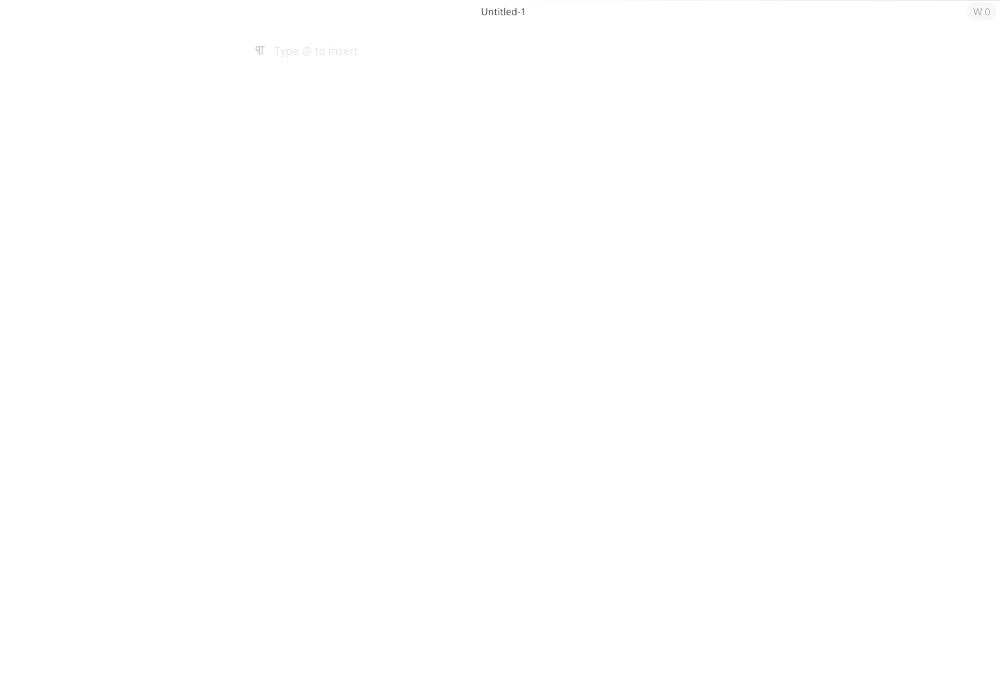
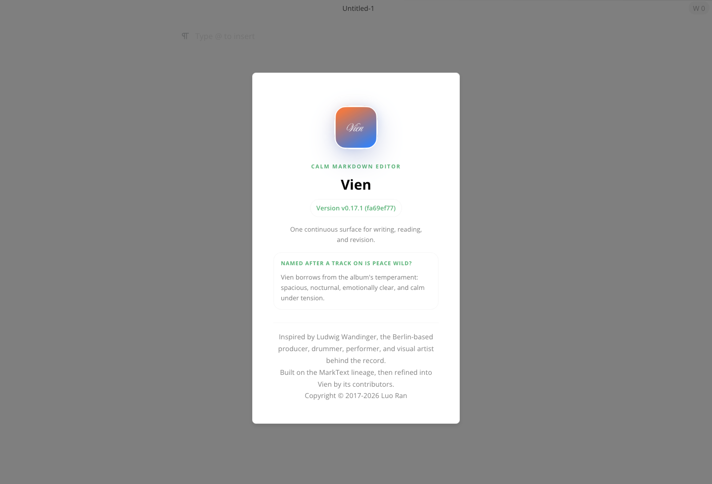

# Vien

Calm Markdown for long-form writing.

Vien is a desktop Markdown editor built for a single continuous surface. You write, read, revise, and export in one place, without a split preview and without an interface that keeps pulling your attention away from the page.

It is local-first, keyboard-friendly, and being shaped to feel especially at home on macOS.

## Screenshots




## Why The Name

Vien takes its name from `Vien`, a track on Ludwig Wandinger's album [*Is Peace Wild?*](https://ludwigwandinger.bandcamp.com/album/is-peace-wild-2).

The record circles around calm, tenderness, and contradiction. Its mood is spacious, nocturnal, and emotionally precise. That was the right brief for this editor: not loud productivity theater, but a writing tool with enough atmosphere to feel intentional and enough restraint to stay out of the way.

Ludwig Wandinger is a Berlin-based producer, drummer, performer, and visual artist whose work moves between experimental electronics, percussion, and visual form. Vien borrows more from that sensibility than from any one sound: clarity without sterility, texture without clutter, quiet without emptiness.

## What Vien Tries To Be

- One writing surface instead of an editor/preview split
- Native-feeling desktop behavior, especially on macOS
- Local Markdown files and folders first
- Fast enough to disappear during real writing
- Quiet, but never generic

## Features

- WYSIWYG Markdown editing in one continuous view
- CommonMark and GitHub Flavored Markdown friendly
- File tree, recent documents, quick open, and tabs
- Focus Mode, Typewriter Mode, and Source Code Mode
- Styled HTML and PDF export
- Pandoc-based import paths for more document types
- Multiple editor themes
- macOS menu bar, Dock integration, recent files, and document edited state

## Stack

- Electron 34
- Vue 3
- Vite
- Muya editor engine
- Element Plus

## Development

```bash
git clone https://github.com/L0stInFades/vien.git
cd vien
pnpm install
pnpm run dev
```

## Build

```bash
pnpm run build
```

## Project Status

Vien is an actively refined continuation of the MarkText lineage.

- Modernized to Electron 34, Vue 3, Vite, and Element Plus
- Hardened with `contextIsolation` enabled and `nodeIntegration` disabled
- Currently focused on native desktop polish, performance, and reliability

## Credits

- Built on the foundation of [MarkText](https://github.com/marktext/marktext)
- Naming and tonal inspiration from [Ludwig Wandinger](https://www.ludwigwandinger.com/) and [*Is Peace Wild?*](https://ludwigwandinger.bandcamp.com/album/is-peace-wild-2)

## License

[MIT](LICENSE)
